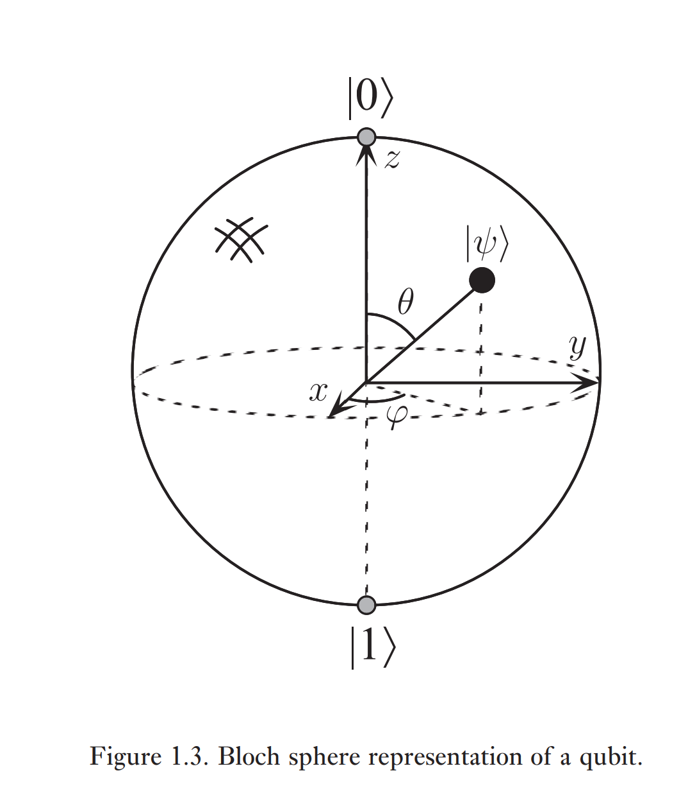

# Introduction and Overview

## Menu 
- [Historical Context](#Historical-Context)
- [Quantum Bits](#Quantum-Bits)
- [Quantum Computers, Quantum Gates and Quantum Circuits](#Quantum-Computers-Quantum-Gates-and-Quantum-Circuits)
- [Quantum Algorithms](#Quantum-Algorithms)
- [Experimental Quantum Information Processing](#Experimental-Quantum-Information-Processing)
- [Quantum Information and Communication](#Quantum-Information-and-Communication)

### Historical Context

> Quantum computation and quantum information is the study of the information processing tasks that can be accomplished using quantum mechanical systems.

To be more understandable, Quantum computation and quantum information is come together by four disparate perspectives: 
1. Physics
2. Computer Science
3. Information Theory
4. Cryptographer

### Quantum Bits

**bit** -> classical computaiton and classical information, determined and certain

**qubit** -> quantum computation and quantum information, undetermined, uncertain, probability.

---

**What is a quantum bit(qubit)**

1. Abstract Mathematical Objects
2. Physical Connection with the system(see Ch7)

---

**Characteristics**

1. Linear Combination: two basic states are $|0\rangle$ and $|1\rangle$. The quantum state is a continuum of states between 2 basic states.

$$|\psi\rangle = \alpha|0\rangle + \beta|1\rangle$$

This is called the *superposition* of the states. $\alpha$ and $\beta$ are complex numbers. Thus, $|\psi\rangle$ is a vector in two-dimensional complex vector space.

2. Restricted Information: we cannot determine the final state according to the quantum mechanism theory. What we can get is just the probability.

$$|\alpha|^2 + |\beta|^2 = 1$$

$|\alpha|^2$ is the probability of state $|0\rangle$ and the $|\beta|^2$ is the probability of state $|1\rangle$.

Based on the complex analysis theory, we can ***transform*** the original formula to 

$$|\psi\rangle = e^{i\gamma}(cos\frac{\theta}{2}|0\rangle + e^{i\psi}sin\frac{\theta}{2}|1\rangle)$$

because $e^{i\gamma}$ has no observable effects, we can rewrite the formula effectively

$$|\psi\rangle = cos\frac{\theta}{2}|0\rangle + e^{i\psi}sin\frac{\theta}{2}|1\rangle$$

The numbers $\theta$ and $\psi$ define a point on the unit three-dimensional sphere.

3. Multiple Qubits

If there's 2 qubits, (could only measure a subset of qubits)

the quantum state is the linear combination of $|00\rangle$, $|01\rangle$, $|10\rangle$, $|11\rangle$:

$$|\psi\rangle = \alpha_{00}|00\rangle + \alpha_{01}|01\rangle + \alpha_{10}|10\rangle + \alpha_{11}|11\rangle$$

As we know, we can only measure a subset of qubits. For example, if we measure the first qubit is 0,

$$|\psi'\rangle = \frac{\alpha_{00}|00\rangle + \alpha_{01}|01\rangle}{\sqrt{\alpha_{00}^2 + \alpha_{01}^2}}$$

> Why do we get this refreshed formula?
> ---
> Firstly, the first qubit is 0, there're only $|00\rangle$ and $|01\rangle$ left.
>
> Secondly, re-normalize the coefficients $\alpha_{0x}$

***Bell State(EPR Pair)***

$$\frac{|00\rangle + |11\rangle}{\sqrt{2}}$$

Why is this important? Because the eventual result of two completely different quantum states is the identical, which is $\frac{1}{2}$.

It's called *correlated outcome*, which enables quantum information go far beyond the classical information.

### Quantum Computers Quantum Gates and Quantum Circuits

### Quantum Algorithms

### Experimental Quantum Information Processing

### Quantum Information and Communication
